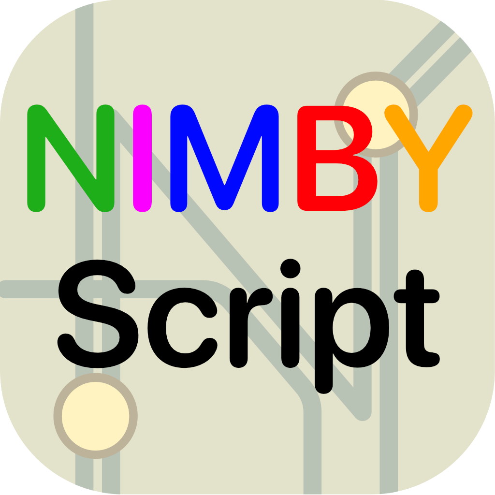

# NimbyScript LSP



[](https://marketplace.visualstudio.com/items?itemName=supermanifolds.nimbyscript)

An unofficial Language Server Protocol (LSP) implementation for [NimbyScript](https://wiki.nimbyrails.com/NimbyScript), the modding language for NIMBY Rails.

## Features

- **Syntax Highlighting** - TextMate grammar for VS Code, semantic tokens for all editors
- **Diagnostics** - Parse errors and semantic validation
- **Completions** - Context-aware completions with documentation
- **Hover Information** - Type information and documentation for symbols
- **Signature Help** - Function parameter hints while typing
- **Go to Definition** - Navigate to symbol definitions, type definitions, and implementations
- **Find References** - Find all references to a symbol
- **Document Symbols** - Outline view of structs, enums, functions
- **Type Hierarchy** - Navigate supertype/subtype relationships
- **Inlay Hints** - Show inferred types and parameter names inline
- **Document Formatting** - Format documents, selections, and on-type formatting

## Editor Support

| Editor | LSP | Syntax Highlighting | Installation |
|--------|-----|---------------------|--------------|
| VS Code | ✅ | ✅ | [Marketplace](https://marketplace.visualstudio.com/items?itemName=supermanifolds.nimbyscript) |
| Neovim | ✅ | ✅ | See [editors/neovim](editors/neovim/README.md) |
| Other LSP clients | ✅ | ❌ | Point to `nimbyscript-lsp` binary |

## LSP Capabilities

| Capability | Status |
|------------|--------|
| `textDocument/completion` | ✅ |
| `completionItem/resolve` | ✅ |
| `textDocument/hover` | ✅ |
| `textDocument/signatureHelp` | ✅ |
| `textDocument/publishDiagnostics` | ✅ |
| `textDocument/documentSymbol` | ✅ |
| `textDocument/semanticTokens/full` | ✅ |
| `textDocument/declaration` | ✅ |
| `textDocument/definition` | ✅ |
| `textDocument/typeDefinition` | ✅ |
| `textDocument/implementation` | ✅ |
| `textDocument/references` | ✅ |
| `textDocument/documentHighlight` | ❌ |
| `textDocument/codeAction` | ❌ |
| `textDocument/codeLens` | ❌ |
| `textDocument/documentLink` | ❌ |
| `textDocument/colorPresentation` | ❌ |
| `textDocument/formatting` | ✅ |
| `textDocument/rangeFormatting` | ✅ |
| `textDocument/onTypeFormatting` | ✅ |
| `textDocument/rename` | ❌ |
| `textDocument/prepareRename` | ❌ |
| `textDocument/foldingRange` | ❌ |
| `textDocument/selectionRange` | ❌ |
| `textDocument/linkedEditingRange` | ❌ |
| `callHierarchy/incomingCalls` | ❌ |
| `callHierarchy/outgoingCalls` | ❌ |
| `textDocument/prepareTypeHierarchy` | ✅ |
| `typeHierarchy/supertypes` | ✅ |
| `typeHierarchy/subtypes` | ✅ |
| `textDocument/inlayHint` | ✅ |
| `workspace/symbol` | ❌ |

## Installation

### VS Code

Install from the [Visual Studio Marketplace](https://marketplace.visualstudio.com/items?itemName=supermanifolds.nimbyscript), or search for "NimbyScript" in VS Code's Extensions view.

### Neovim

See [editors/neovim/README.md](editors/neovim/README.md) for detailed instructions. The LSP binary is automatically downloaded.

### Other Editors

Download the latest `nimbyscript-lsp` binary for your platform from [GitHub Releases](https://github.com/supermanifolds/nimby_lsp/releases/latest):

| Platform | Binary |
|----------|--------|
| macOS (Apple Silicon) | `nimbyscript-lsp-darwin-arm64` |
| macOS (Intel) | `nimbyscript-lsp-darwin-x64` |
| Linux (x64) | `nimbyscript-lsp-linux-x64` |
| Linux (ARM64) | `nimbyscript-lsp-linux-arm64` |
| Windows (x64) | `nimbyscript-lsp-win32-x64.exe` |
| Windows (ARM64) | `nimbyscript-lsp-win32-arm64.exe` |

Configure your editor's LSP client to run the binary with no arguments. The server communicates over stdio.

### Building from Source

```bash
git clone https://github.com/supermanifolds/nimby_lsp
cd nimby_lsp
cargo build --release
# Binary at target/release/nimbyscript-lsp
```

## Contributing

See [CONTRIBUTING.md](CONTRIBUTING.md) for development setup and guidelines.

## License

MIT OR Apache-2.0
